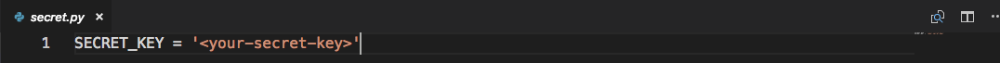
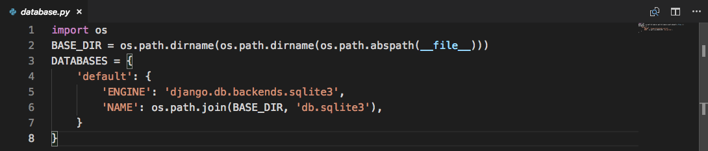

## Installation
Python 2.7 has been used for the project. A virtualenv with python2.7 installation and the requirements can be instantiated as such  
```
 virtualenv --python=/usr/bin/2.7 <src-to-directory>
 source <src-to-directory>/bin/activate
 pip install -r requirements.txt   
```

## Storing your Secret Key
Secret Key should be stored and imported from the ```secret.py``` file defined in root of the directory.


## Migrating Database
To add your own database, change the settings in ```database.py``` to the desired setting then run
```
python manage.py migrate
python manage.py makemigrations
```



## For further more information see the [documentation](docs/documentation.md).


## __Created By__  
 * Krishnanunni  
 * Computer Science  
 * College Of Engineering trivandrum